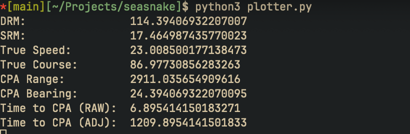
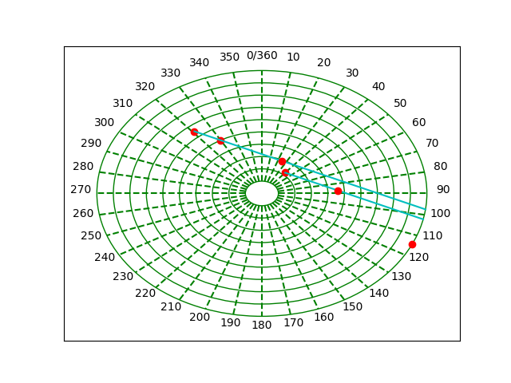

# seasnake-jams

A small python tool to solve maneuving board problems automatically while visually showing a recreation visually with matplotlib.

# How to Use

### Requirements

This project requires numpy and matplotlib.

### Example Usage

The core class of this tool is the `ManueveringBoard`. Create an instance of a manuevering board with the center vessel's course, speed, and optionally scale.

```python
moboard = ManeuveringBoard(11, 40) # Create a maneuvering board where formation course is 40ºT
                                   # and speed is 11 kts
```

Create fixes represented with the `Fix` class requiring a bearing and range from center vessel as well as time of the fix.

```python
fix1 = Fix(321, 6500, 1000)
fix2 = Fix(330, 5000, 1003)
```

Finally call the moboards `solve_cpa()` function with the fixes.

```python
moboard.solve_cpa(fix1,fix2)
```

This example will produce the following visual and terminal output:




# Warning

This project is very much still under development. Many things are still broken so confirm results are accurate by hand.


